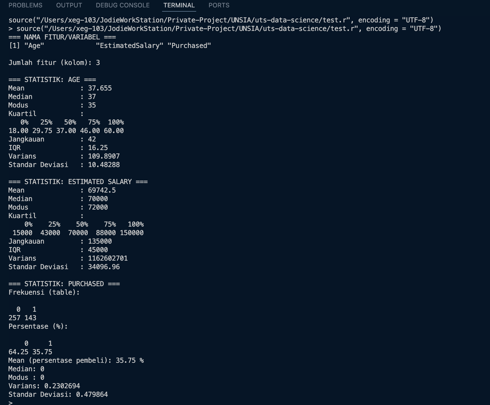

# UTS DATA SCIENCE


> ### Personal Information
> * Nama: Jodie Soluna Manopo
> * NIM: 230401010196
> * Kelas: IF402
> * Prodi: PJJ Informatika
> * Matkul: DATA SCIENCE
> * Type: UTS

## ANALISIS DESKRIPTIF DATA SOCIAL_NETWORK_ADS
Program berbasis R ini dibuat untuk memenuhi UTS DATA SCIENCE. Program ini merupakan program yang mencakup fitur untuk membuat analisa deskriptif terhadap data social_network_ads.csv

## SAMPLE OUTPUT 
---


---

## HOW TO USE

### 1. INSTALASI
Run R then
---
```bash
    > install.packages("modeest")
```
### 2. Run Script
---
```bash
    foo@bar:~$ Rscript test.r
```

### 3. Output to .txt file
---
```bash
   foo@bar:~$ Rscript test.r > output.txt
```
